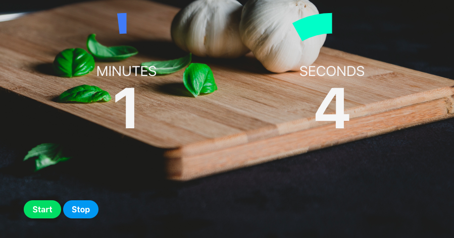

Welcome to Rice!

Rice is the largest crop (grown for human consumption) on the world. 

Rice is a simple how to guide to cooking rice at home. There are many ways to cooking White Rice, this is our simple approach. Offering portioning options and an alert timer. Set it, forget it and enjoy!

---Installation Instructions---

Fork and clone repository, or visit Rice.surge.sh. 

---Instructions---

Please choose a single portion option, i.e. per serving or per person.
Set the timer, an audio alert will activate when the timer has run to zero. 

Start and stop timer here. If you would like to refresh the timer, select refresh from the menu above. You previous portion selection will be preserved. 

Timer Interface, an audio and visual alarm will trigger once the time is completed. 

Photo Credit: Photo by Sébastien Marchand on Unsplash

Icon Credit: Font Awesome 